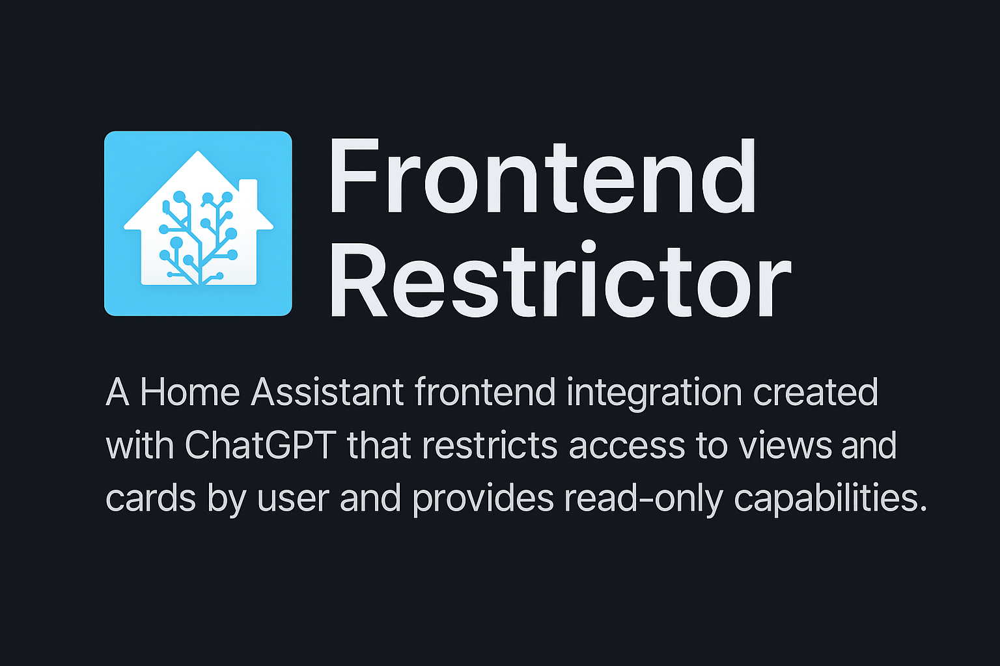
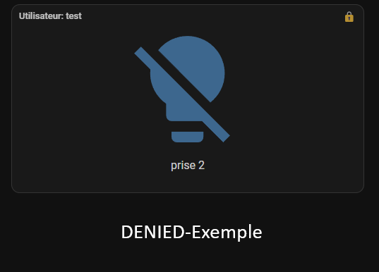

# 🔒 Restrictor Card

> **Control access and interactions on your Home Assistant Lovelace dashboards.**  
> Restrictor Card allows you to **lock, hide, or protect cards** depending on the connected user.  
>
> 🧠 Developed in collaboration with **ChatGPT (OpenAI)**.



---

## ✨ Features

- 👤 **User-based filtering** — Allow or deny card access per username.
- 🔒 **Read-only / hidden modes** — Prevent interactions or fully hide the card.
- 🧱 **Full compatibility** with **Sections / Grid views**.
- 🔁 **Auto-lock persistence** after view or dashboard refresh.
- ⚙️ **Configurable overlay opacity** for locked cards.
- 🧩 Works with **any Lovelace card** (`area`, `entities`, `picture`, `stacks`, etc.).
- 🖋️ Optional **user badge** to show who’s logged in.

---

## 🧰 Installation via HACS

### 1️⃣ Add the repository
In **HACS → Frontend → 3 dots (⋮) → Custom repositories**, add:  https://github.com/JT21002/hacs-frontend-restrictor
Category: `Lovelace`

### 2️⃣ Install the card
Search for **Restrictor Card** and click **Download**.

### 3️⃣ Add the resource
In Home Assistant:  
➡️ **Settings → Dashboards → Resources**  
Ensure this resource exists:

/hacsfiles/hacs-frontend-restrictor/restrictor-card.js

Type: `JavaScript Module`

### 4️⃣ Reload Lovelace
Press **Ctrl + F5** or reload resources.

---

## ⚙️ Basic Configuration

```yaml
type: custom:restrictor-card
allowed_users: [root]        # Users allowed to interact
mode: read_only              # "read_only" or "hidden"
overlay_opacity: 0.1         # Overlay opacity (0–1)
show_user: true              # Show current user in badge

card:
  type: area
  area: chambre_joshua
  display_type: picture
  features_position: bottom
  color: cyan

```

🧱 Layout Options (Grid/Section views)

| Option                 | Type   | Description                |
| ---------------------- | ------ | -------------------------- |
| `grid_options.rows`    | number | Number of grid rows        |
| `grid_options.columns` | number | Number of grid columns     |
| `rows` / `columns`     | number | Shortcuts for grid options |
| `view_layout`          | object | Auto-managed by Lovelace   |

🧩 Example:
```yaml
grid_options:
  rows: 4
  columns: 6
```

🔐 Lock Modes

| Mode        | Effect                                           |
| ----------- | ------------------------------------------------ |
| `read_only` | Card visible but all controls disabled.          |
| `hidden`    | Card is completely hidden for non-allowed users. |


👁️ Visual Examples

| Allowed user                                     | Denied user                                    |
| ------------------------------------------------ | ---------------------------------------------- |
|  |  |

🧩 Advanced Usage

🔹 Stack multiple cards

```yaml
type: custom:restrictor-card
allowed_users: [root]
mode: read_only
card:
  type: vertical-stack
  cards:
    - type: entities
      entities:
        - light.living_room
        - light.kitchen
    - type: picture-entity
      entity: camera.living_room
```

```yaml
🔹 Lock an entire view
Wrap all cards in a single Restrictor Card:
type: custom:restrictor-card
allowed_users: [root]
mode: read_only
card:
  type: vertical-stack
  cards:
    - type: markdown
      content: "Welcome back, admin!"
    - type: grid
      cards:
        - type: button
          entity: light.office
```

🛠️ Troubleshooting
| Problem                | Solution                                               |
| ---------------------- | ------------------------------------------------------ |
| Card doesn’t appear    | Check Lovelace resource path.                          |
| User not detected      | Confirm your Home Assistant user name matches exactly. |
| Subcards remain active | Update to version ≥ **v1.0.2**.                        |
| Overlay invisible      | Increase `overlay_opacity` to 0.2 or higher.           |


💡 About
This project was designed and refined with the help of ChatGPT (OpenAI)
to demonstrate how AI can assist in developing, documenting, and packaging
a complete HACS frontend extension for Home Assistant.

🧡 Support & Contribution
- ⭐ Star this project on GitHub
- 🐞 Report bugs or suggest features under Issues
- 🤝 Contributions are welcome!